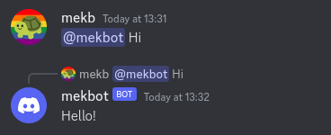

    <h1>Discord AI Bot</h1>
    <h3 align="center">Discord bot to interact with <a href="https://github.com/jmorganca/ollama">Ollama</a> as a chatbot</h3>
    <h3></h3>
    <h3></h3>

### Set-up instructions
1. Install [Node.js](https://nodejs.org) (if you have a package manager, use that instead to install this)
2. Install [Ollama](https://github.com/jmorganca/ollama) (ditto)
3. Pull (download) a model, e.g `ollama pull orca` or `ollama pull llama2`
4. Start Ollama by running `ollama serve`
5. [Create a Discord bot](https://discord.com/developers/applications)
    - Under Application » Bot, make sure Message Content Intent is enabled
6. Invite the bot to a server
    1. Go to Application » OAuth2 » URL Generator
    2. Enable `bot`
    3. Enable Send Messages, Read Messages/View Channels, and Read Message History
    4. Under Generated URL, click Copy and paste the URL in your browser
7. Rename `.env.example` to `.env` and edit the file
    - You can get the token from Application » Bot » Token, **never share this with anyone**
8. Start the bot with `npm start`
